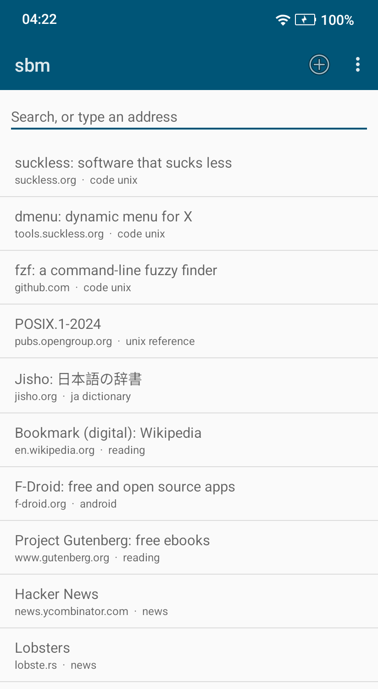
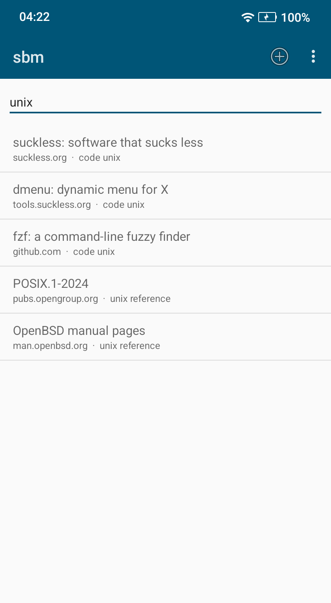

# sbm for Android

Your [sbm](https://github.com/equwal/sbm) bookmarks on your phone.

 

How sync looks between bm and the browser add-on:
[demo, 80 seconds](https://github.com/equwal/sbm-sync#sbm-sync).

- **Search as you type**, with the fuzzy match of fzf. Go opens the first
  match. Text that is no bookmark opens as an address, or as a web search,
  as in bm.
- **Live preview:** while you search, the page of the first match shows
  above the list. Press and hold a bookmark, then Preview, to see another
  one. Tap the address above the preview to open the page. An http page
  shows with https. Turn the preview off with Page preview in the menu.
- **Tap to open**, press and hold to copy or share.
- **Share to sbm** from any browser to add the page.
- **Sync** with bm on your computers and the sbm add-on for Firefox and
  Chrome, through an [sbm-sync](https://github.com/equwal/sbm-sync) server.
- Or **open a bookmark file** that Syncthing, git or a file app keeps.

The bookmarks stay an sbm file: one bookmark per line,
`URL<tab>description<tab>tags`.

## Sync

In the menu, "Sign in to sync" uses https://sbm.subread.space unless you
type another server. Create an account on the website of the server. Sync on
sbm.subread.space is free. You can also [run your own
server](https://github.com/equwal/sbm-sync): it is free software.

After a sign-in, the app syncs when you open it and after you add a
bookmark. Without a file of your own, the app keeps the file in its own
storage.

## Privacy

The app has no ads, no analytics and no trackers. It uses the network for
two things only. Sync, after you sign in, and only with the server that you
choose. And the live preview, which loads the page of a bookmark from its
site while you search, as a browser does; Page preview in the menu turns it
off. See the [privacy policy](https://sbm.subread.space/privacy).

## Build

    ./gradlew assembleDebug testDebugUnitTest

JDK 17 or later and the Android SDK (platform 36). The app uses only the
Android framework: no AndroidX, no Google libraries.

Release builds are signed when `SBM_KEYSTORE_FILE` and
`SBM_KEYSTORE_PASSWORD` are set (key alias `sbm`). The Google Play build has
no link to Ko-fi, because Google Play does not allow links to payments
outside Google Play:

    ./gradlew bundleRelease -PplayStore=true    # Google Play
    ./gradlew assembleRelease                   # F-Droid and GitHub

## License

AGPL-3.0. If sbm is useful to you, you can support it on
[Ko-fi](https://ko-fi.com/truex).
